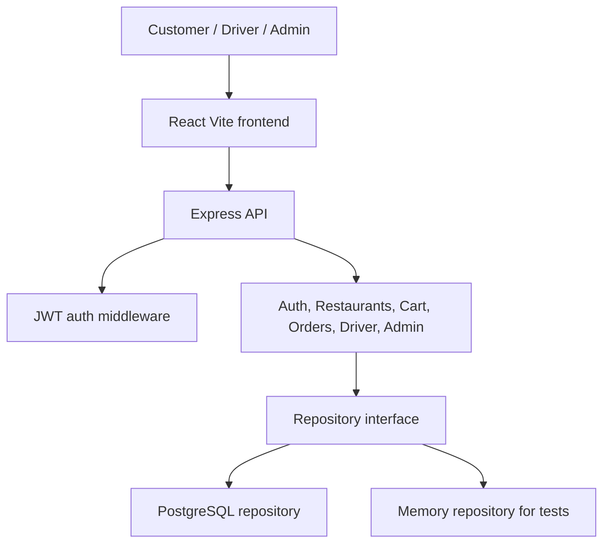

# Architecture

DoorStep-Mobile is a two-service delivery platform with a strict separation between frontend user experience and backend business operations.

## System Overview

## Frontend

The frontend is a React + TypeScript Vite app. It is organized around pages, state providers, API client code, and reusable UI primitives.

Main responsibilities:

- Landing and portfolio-grade product presentation.
- Customer ordering flow.
- Driver delivery queue.
- Admin operations overview.
- API health visibility.
- Environment-based backend URL.

## Backend

The backend is an Express + TypeScript API. Route modules are grouped by business capability.

Main responsibilities:

- Authentication and JWT issuance.
- Role-based access control.
- Restaurant and menu catalog.
- Cart and checkout.
- Order lifecycle tracking.
- Driver and admin operations.
- Swagger/OpenAPI documentation.
- PostgreSQL persistence.

## Data Access

`DoorstepRepository` defines the application data contract. Two implementations exist:

- `PostgresRepository`: production persistence.
- `MemoryRepository`: deterministic tests and local demo fallback.

This keeps route behavior testable without requiring a database for every test.

## Deployment

- Vercel deploys the frontend from `frontend/dist`.
- Render deploys the backend from `backend/dist`.
- PostgreSQL is managed by Render or any compatible provider.
- Docker Compose runs the full stack locally.

